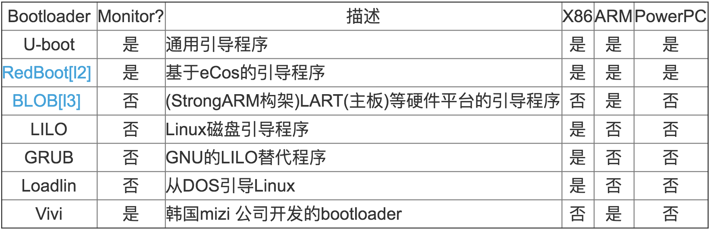

# Android系统启动过程
1. 参考资料
	1. <http://www.cnblogs.com/pngcui/p/4665106.html>
	1. <http://blog.csdn.net/wjzhangcsu/article/details/50556096>
1. 介绍

	这个Android系统启动总体分为三个阶段
	1. BootLoader引导即uBoot.bin
	1. linux内核启动即zImage
	1. Android系统启动即ramdisk.img与system.img
	
	以上四个文件都是经过自己编译后生成的且通过烧写测试，接下来开始说这三大部分的启动过程。

## Bootloader
### 介绍
BootLoader是在操作系统运行之前运行的一段程序，它可以将系统的软硬件环境带到一个合适状态，为运行操作系统做好准备。这样描述是比较抽象的，但是它的任务确实不多，终极目标就是把OS拉起来运行。

各环境下的BootLoader对比如下(其中Monitor可以当做提供了命令行接口逇Bootloader):


bootloader之前，还有2个load起作用。因为不同处理器芯片厂商对armcore的封装差异比较大，所以不同的arm处理器，对于上电引导都是由特定处理器芯片厂商自己开发的程序，这个上电引导程序通常比较简单，会初始化硬件，提供下载模式等，然后才会加载通常的bootloader。

### 组成
下面是几个arm平台的bootloader方案：

1. marvell(pxa935) :bootROM + OBM+ BLOB
1. informax(im9815) :bootROM + barbox + U-boot
1. mediatek(mt6516/6517) :bootROM+ pre-loader + U-boot
1. broadcom(bcm2157) :bootROM + boot1/boot2 + U-boot

下图是broadcom从上电到uboot的流程，其中

CP：协处理器，通常是多媒体加速器

AP：应用处理器


最常用的bootloader还是U-boot，可以引导多种操作系统，支持多种架构的CPU。

> 手机系统不像其他的嵌入式系统，它还需要在启动的过程中关心CP的启动，这个时候就涉及到CP的image和唤醒时刻，而一般的嵌入式系统的uboot只负责引导OS内核。所以这里我们也暂不关心CP的启动，而主要关心AP侧。

大致上可以分成两个阶段：

1. 汇编代码；
2. C代码。

### uboot第一阶段（汇编代码）
U-boot的第一条指令从cpu/arm920t/start.S文件开始，第一阶段主要做了如下事情：

1. 设置CPU进入SVC模式(系统管理模式)，cpsr[4:0]=0xd3。
2. 关中断，INTMSK=0xFFFFFFFF, INTSUBMSK=0x3FF。
3. 关看门狗，WTCON=0x0。
4. 调用s3c2410_cache_flush_all函数，使TLBS，I、D Cache，WB中数据失效。
5. 时钟设置CLKDIVN=0x3 , FCLK:HCLK:PCLK = 1:2:4。
6. 读取mp15的c1寄存器，将最高两位改成11，表示选择了异步时钟模型。
7. 检查系统的复位状态，以确定是不是从睡眠唤醒。
6. 询问是否进入CPU初始化
7. CPU的初始化，即cpu_init_crit函数，完成以后回到主函数
1. 跳转到第二阶段C代码中去
```
ldr    pc, _start_armboot 2 
3 _start_armboot:    .word start_armboot
```

### uboot第二阶段（C代码）
第二阶段从文件/lib_arm/board.c的start_armboot()函数开始。

1. 定义一个struct global_data结构体指针gd，struct global_data结构体对象gd_data，定义一个struct bd_info结构体对象bd_data，定义一个指向函数的二级指针init_fnc_ptr，定义的全局结构体对象都是放在堆栈中的,gd是放在寄存器中的。
2. gd=&gd_data，gd->bd = &bd_data，并且全部空间清0。
3. init_fnc_ptr = init_sequence(一个初始化函数指针数组)。将会在接下来的for循环中提取出每一个函数来依次执行完。
4. 配置可用的flash空间，并且打印出相关信息，flash_init()和display_flash_config()。
5. mem_malloc_init()函数,分配堆空间.
6. env_relocate该函数的作用是将0x33ef0000开始16K的环境参数拷贝到堆空间中去。
7. gd->bd->bi_ip_addr = getenv_IPaddr ("ipaddr")通过这中方式获得环境变量列表中的ipaddr参数（开发板ip），获得环境变量中的MAC地址，设置到gd->bd->bi_enetaddr[reg]中。
8. devices_init函数，创建了devlist，但是只有一个串口设备注册在内。
9. console_init_r函数：控制台完全初始化，此后可以使用函数serial_getc和serial_putc或者putc和getc来输出log。
10. 使能中断，如果有网卡设备，设置网卡MAC和IP地址。
11. main_loop ()；定义于common/main.c。到此所有的初始化工作已经完成，main_loop在标准输入设备中接受命令，然后分析，查找和执行。
12. 在上面的main_loop函数中，通常在开发完成的阶段都会设置一个bootcmd的环境变量，然后将延时bootdelay设置成0，这样当u-boot跑到这里的时候就不会因为用户按下了任意键就进入了命令行模式。
1. uBoot 引导内核启动的最后一步是：通过一个函数指针 thekernel()带三个参数跳转到内核（ zImage ）入口点开始执行，此时， u-boot 的任务已经完成，控制权完全交给内核（ zImage ）。（在 uBoot 的文件lib_arm\bootm.c中定义了 thekernel, 并在 do_bootm_linux 的最后执行 thekernel）

## Linux Kernel阶段
zImage是linux内核编译之后产生的最终文件，zImage是经过了高压缩之后再和解压缩程序合并在一起生成的。可以将linux的启动大致分成3段：

### zImage解压缩
内核启动的执行的第一条的代码：arch/arm/boot/compressed /head.S文件中，Head.S文件主要功能是实现压缩内核的解压和跳转到内核vmlinux内核的入口。

### kernel的汇编启动阶段
第二阶段的代码是从\arch\arm\kernel\head.S开始的。内核启动第二阶段主要完成的工作有，cpu ID检查，machine ID(也就是开发板ID)检查，创建初始化页表，设置C代码运行环境，跳转到内核第一个真正的C函数startkernel开始执行。

### kernel的c启动阶段

经过解压缩和汇编启动两个阶段，将会进入init/Main.c中的start_kernel()函数去继续执行:

1. 打印版本信息，如内核、编译器、作者、日期
1. setup_arch()主要做一些板级初始化，cpu初始化，tag参数解析，u-boot传递的cmdline解析，建立mmu工作页表(memtable_init)，初始化内存布局，调用mmap_io建立GPIO,IRQ,MEMCTRL,UART，及其他外设的静态映射表，对时钟,定时器，uart进行初始化
1. cpu_init():打印一些关于cpu的信息，比如cpu id，cache 大小等。另外重要的是设置了IRQ、ABT、UND三种模式的stack空间，分别都是12个字节。最后将系统切换到svc模式。
1. build_all_zonelists():建立系统内存页区(zone)链表
1. printk(KERN_NOTICE "Kernel command line: %s\n", saved_command_line);打印出从uboot传递过来的command_line字符串，在setup_arch函数中获得的。
1. sched_init():初始化每个处理器的可运行队列，设置系统初始化进程即0号进程。
1. init_IRQ():初始化系统中所有的中断描述结构数组：irq_desc[NR_IRQS]。接着执行init_arch_irq函数，该函数是在setup_arch函数最后初始化的一个全局函数指针，指向了smdk2410_init_irq函数（in mach-smdk2410.c）,实际上是调用了s3c24xx_init_irq函数。在该函数中，首先清除所有的中断未决标志，之后就初始化中断的触发方式和屏蔽位，还有中断句柄初始化，这里不是最终用户的中断函数，而是do_level_IRQ或者do_edge_IRQ函数，在这两个函数中都使用过__do_irq函数来找到真正最终驱动程序注册在系统中的中断处理函数。
1. softirq_init()：内核的软中断机制初始化函数。
1. console_init()：初始化系统的控制台结构，该函数执行后调用printk函数将log_buf中所有符合打印级别的系统信息打印到控制台上。
1. rest_init()：调用kernel_thread()创建1号内核线程，调用schedule()函数切换当前进程，在调用该函数之前，Linux系统中只有两个进程，即0号进程init_task和1号进程kernel_init，其中kernel_init进程也是刚刚被创建的。调用该函数后，1号进程kernel_init将会运行！
1. 最后对Linux应用程序进行初始化。1号kernel_init进程完成linux的各项配置(包括启动AP)后，就会在/sbin,/etc,/bin寻找init程序来运行。该init程序会替换kernel_init进程（注意：并不是创建一个新的进程来运行init程序，而是一次变身，使用sys_execve函数改变核心进程的正文段，将核心进程kernel_init转换成用户进程init）
1. **此时处于内核态的1号kernel_init进程将会转换为用户空间内的1号进程init。**
	1. 父进程init将根据/etc/inittab中提供的信息完成应用程序的初始化调用。
	1. 然后init进程会执行/bin/sh产生shell界面提供给用户来与Linux系统进行交互。
	1. 调用init_post()创建用户模式1号进程。
	1. 在init_post()中最终调用下面的任何一个入口（按顺序，第一个执行成功后将不返回）

			```
			if (execute_command) {
				run_init_process(execute_command); 
				printk(KERN_WARNING "Failed to execute %s.  Attempting defaults...\n", execute_command);
			}
			run_init_process("/sbin/init");
			run_init_process("/etc/init");
			run_init_process("/bin/init");
			run_init_process("/bin/sh"); 33 
			
			panic("No init found.  Try passing init= option to kernel. See Linux Documentation/init.txt for guidance.");
			```
1. 至此Linux内核初始化完成，终于开始加载Android系统了

## android启动
Android的启动过程是从进程init开始的，所以它是后续所有进程的祖先进程。

### init进程

源码位于system/core/init目录。主要做了以下事情：
	
1. 重新设置子进程终止时信号SIGCHLD的处理函数
2. 将kernel启动过程中建立好的文件系统框架mount到相应目录
3. open_devnull_stdio()，将init进程的标准输入、输出、出错设备设置为新建的设备节点/dev/__null__
4. log_init()，创建并打开设备节点/dev/__kmsg__
5. 读取并解析rc配置文件
	1. 先从文件/sys/class/BOOT/BOOT/boot/boot_mode读出启动方式：FactoryMode, '4'；ATE Factory Mode, '6'。看是否是facatory模式。
	1. 如果是的话，需要读取并解析两个文件：init.factory.rc和init.rc。
	1. 如果是正常启动，则暂时先读取init.rc。
	这里在读取解析文件的时候，是以行为最小可执行单位在解析。关于书写init.rc文件的初始化脚本语言的规则，可以上网查找。解析之后并不会马上执行，而是在init进入服务循环之前统一根据其命令本身所带的条件来执行。
1. 导入kernel的cmdline，也就是u-boot传递给kernel的参数。**查看其中是否具有androidboot.xxx(androidboot.mode、androidboot.hardware等)参数，如果有，将其保存在同名字的xxx(mode、hardware)全局变量中**。这里特别说明的是hardware这个参数，从kernel中导出一部分之后，又要从/proc/cpuinfo中导出一部分来组合成完整的hardware参数，因为后面接下来会读取并解析以特定平台的rc文件。
2. 读取特定平台相关的initrc文件，如:init.mt6516.rc。对于service，这里会给每个服务建立一个struct service的结构体，全部挂入链表service_list之中，在init最后才启动.
3. 检查解析出来的所有命令行当中是否有属于early-init的，如果有，将其提出来加入到链表action_queue之中，马上将其执行掉
4. device_init()函数将会打开uevent的netlink socket，遍历/sys/class、/sys/block、/sys/devices目录，检查各级目录的uevent文件，处理在vold服务起来之前由kernel所发出来的deviceadd, remove等事件。
1. property_init(),顾名思义，是属性初始化。首先创建一个名字为system_properties的匿名共享内存区域，对并本init进程做mmap读写映射，其余共享它的进程只有读的权限。然后将这个prop_area结构体通过全局变量__system_property_area__传递给propertyservices。
接着调用函数load_properties_from_file(PROP_PATH_RAMDISK_DEFAULT)从/default.prop文件中加载编译时生成的属性
1. 如果在root目录下有initlogo.rle文件存在，这个是两张android字样的缕空图片，将其读入fb中显示到LCD上。同时也要往串口上输出"A N D R O I D"。如果图片不存在，就没有这两项的输出
2. 设置相应的属性：
	
	```
	property_set("ro.factorytest", "0")
	property_set("ro.serialno", serialno[0]? serialno :"");
	property_set("ro.bootmode", bootmode[0]? bootmode :"unknown");
	property_set("ro.baseband", baseband[0]? baseband :"unknown");
	property_set("ro.carrier", carrier[0]? carrier :"unknown");
	property_set("ro.bootloader", bootloader[0]? bootloader :"unknown");
	 
	property_set("ro.hardware", hardware);
	snprintf(tmp, PROP_VALUE_MAX,"%d", revision);
	property_set("ro.revision", tmp);
	```
1. 开始执行以init为trigger的命令行
2. 启动属性服务：property_set_fd = start_property_service();
3. 创建一对socket，用来做信号方面的处理
4. 执行eraly-boot和boot为trigger的命令。
5. 执行init.rc中以property:开头的属性设置语句，同时使能属性触发方式。
6. 接下来就是利用poll机制监听前面创建的几个fd的动态
7. 到这里init就进入了死循环中一直在监听ufds中的4个文件描述符的动静，如果有POLLIN的事件，就做相应的处理，所以init并没有退出或者进入idle，而是被当做一个服务在运行。第4个文件描述符是keychord_fd，暂时不清楚这个怎么用，不过通过它也可以启动服务，可参考源码。
	
	Android启动图示：
	
	